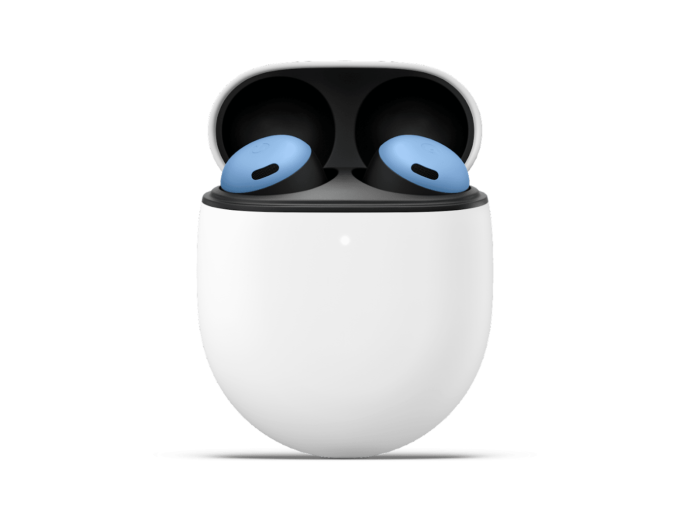
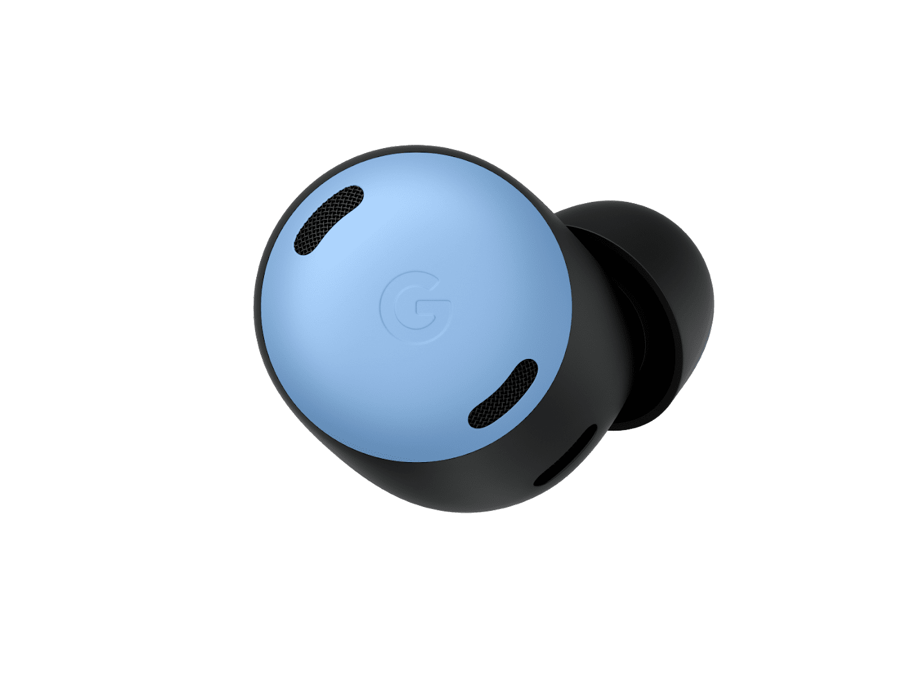

# Google-Store-Proyect-frontend

Es un proyecto desarrollado como práctica de **desarrollo web frontend**, implementado con **HTML5, CSS3 y JavaScript**, basado en la recreación de dos productos nuevos dentro de la página de Google Store.

---

## Objetivos del proyecto

El objetivo principal fue **integrar dos nuevos productos** dentro de una interfaz existente, aplicando buenas prácticas de estructura HTML, estilos CSS y lógica JavaScript.  
Las metas específicas fueron:

- Implementar la web utilizando **HTML5 y CSS3** en versiones *desktop, tablet y mobile*.  
- Añadir interactividad con **JavaScript**, incluyendo:
  - Cambio dinámico de imágenes.
  - Selección de colores.
  - Carrito persistente mediante `localStorage`.

---

## Desarrollo técnico

- Diseño de una aplicación web (nivel 1)  
- Maquetación responsive con HTML5 y CSS3 (nivel 1)  
- Creación de una página web estática (nivel 1)  
- Implementación de interactividad con JavaScript (nivel 1)

---

## Tecnologías utilizadas

- **HTML5**  
- **CSS3**  
- **JavaScript (ES6)**

---

## Estructura del proyecto

```
/Google-Store-Proyect-frontend
│── index.html
│── style.css
│── script.js
│── /images
│── /page
```

---

## Funcionalidades implementadas con JavaScript

El proyecto incluye varias interacciones dinámicas que mejoran la experiencia del usuario. A continuación se muestran fragmentos reales del código.

---

### Cambio de imagen principal según la miniatura seleccionada

```javascript
const mainImage = document.getElementById("mainImage");
const thumbnails = document.querySelectorAll(".product-thumbs img");

for (let i = 0; i < thumbnails.length; i++) {
  thumbnails[i].addEventListener("click", function () {
    mainImage.src = this.src;
  });
}
```

Permite actualizar la imagen principal del producto al hacer clic en cualquiera de las miniaturas.

---

### Selección de color del producto

```javascript
const colorButtons = document.querySelectorAll(".color-dot, .color-dot-watch");

for (let i = 0; i < colorButtons.length; i++) {
  colorButtons[i].addEventListener("click", function () {

    if (this.classList.contains("selected")) {
      this.classList.remove("selected");
      selectedColor = "";
      return;
    }

    for (let j = 0; j < colorButtons.length; j++) {
      colorButtons[j].classList.remove("selected");
    }

    this.classList.add("selected");
    selectedColor = this.dataset.color;
  });
}
```

El usuario puede seleccionar un color, que se guarda para añadirlo posteriormente al carrito.

---

### Añadir productos al carrito

```javascript
addCartBtn.addEventListener("click", function () {
  const quantity = quantitySelect.value;

  if (selectedColor === "") {
    alert("Debe de seleccionar un color para añadir al carrito.");
    return;
  }

  const itemText = `${quantity},${productName},${selectedColor}`;
  cart.push(itemText);
  localStorage.setItem("cart", cart.join("|"));
  alert(`Se añadió ${quantity} ${productName} de color ${selectedColor}.`);
});
```

El carrito se almacena en `localStorage`, permitiendo que los datos persistan mientras el usuario navega.

---

## Ejemplo de estructura HTML

Fragmento del HTML principal del producto:

```html
<main class="product-container">
    <section class="product-gallery">
        <div class="product-thumbs">
            
            
        </div>

        <div class="product-main">
            
        </div>
    </section>
</main>
```

---

## 📝 Conclusión

Este proyecto me permitió trabajar el flujo completo del desarrollo frontend:

- Interpretación de un diseño estático  
- Construcción de una interfaz responsive con HTML5 y CSS3  
- Implementación de interactividad real con JavaScript  
- Gestión de estado mediante `localStorage` y `sessionStorage`  
